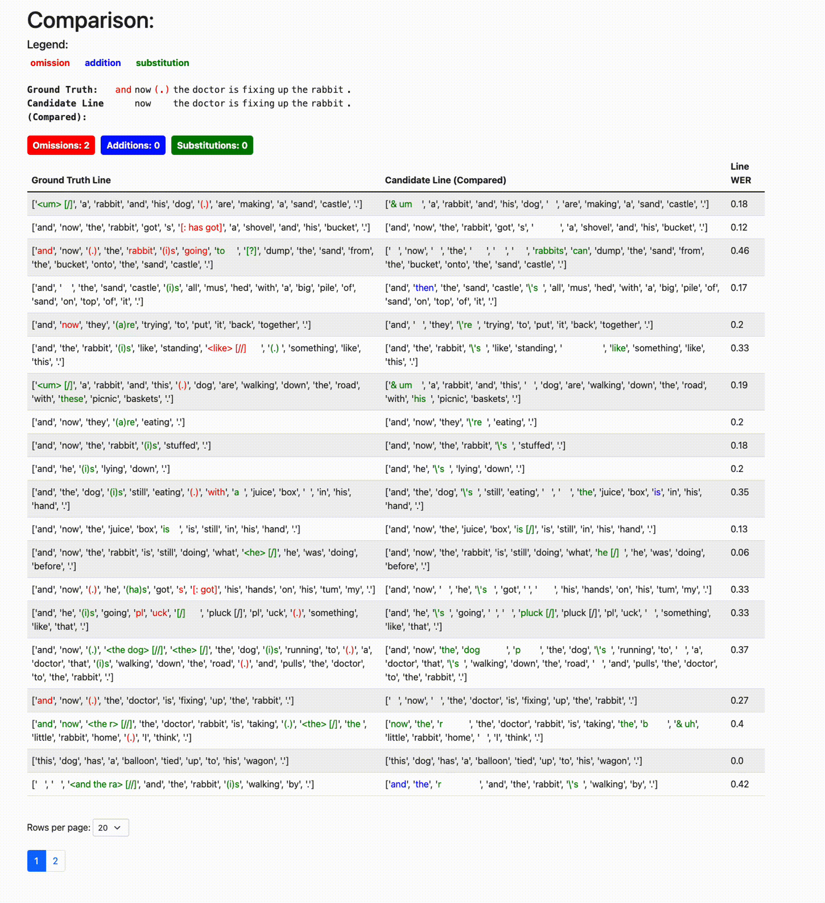

# Word Error Rate (WER) Calculation with Multiple Strategies

This project provides a set of scripts for calculating Word Error Rate (WER) on transcriptions using various strategies and methods. It includes processing of ground truth and candidate files, line-by-line and whole-text WER calculations, and generates output reports in CSV format.

## Table of Contents
- [Project Overview](#project-overview)
- [Files Overview](#files-overview)
- [Prerequisites](#prerequisites)
- [Usage](#usage)
  - [Customizing File Paths](#customizing-file-paths)
  - [Available Strategies](#available-strategies)
  - [Running the Script](#running-the-script)
  - [Output](#output)
- [License](#license)

## Project Overview

This project calculates the WER for two transcription files (ground truth and candidate) using different WER strategies. The main script reads the files, processes the lines, removes unwanted content, and then applies WER calculations through multiple methods, including annotation-based comparisons. The results are saved in CSV files for easy review and analysis.

### Web result demo

Watch this demo of the web:



## Files Overview

- **`wer_strategy.py`**: Defines the different strategies for WER calculation.
- **`wer_calculator.py`**: Contains the main functions for computing WER using the defined strategies.
- **`main.py`** (this script): Loads the files, processes them, applies WER strategies, and saves the results in CSV format.

## Prerequisites

Ensure you have Python installed, along with the following libraries:
- `pandas`: For data manipulation and exporting results.
- `re`: For text processing (regular expressions).
- `logging`: For logging information during execution.

Install the required packages with:
```
pip install pandas
```

## Usage

### Customizing File Paths

1. **Ground Truth and Candidate Paths**: Update the `ground_truth_path` and `candidate_path` variables to the paths of your ground truth and candidate files, respectively.
2. **Output Paths**: Modify `output_csv_path` and `annotation_output_csv_path` to define where the output CSV files will be saved.

### Available Strategies

The script includes several WER strategies that can be applied depending on your analysis needs:

1. **WERAnnotationOnlyWholeTextStrategy**: Calculates WER based on entire text as a whole.
2. **WERAnnotationOnlyLineByLineStrategy**: Calculates WER for each line independently.
3. **WERAnnotationWholeTextStrategy**: Calculates WER treating the entire text as a whole but with annotations.
4. **WERAnnotationLineByLineStrategy**: Calculates WER for each line, with annotations.
5. **WERAnnotationLineByLineStrategy_marked**: Adds visual markers to highlight differences in the WER calculation results line by line.

Each strategy can be customized and set through `WERCalculator`.

### Running the Script

To run the main script, execute:

```
python main.py
```

### Sample Workflow in `main.py`

1. **Line Extraction and Preprocessing**:
   - `extract_lines_from_file` extracts lines from the ground truth and candidate files.
   - `remove_nak_to_end` removes unwanted content starting with "NAK" from each line.
2. **WER Calculations**:
   - Several strategies are applied:
     - **Whole Text WER Calculation** (using `WERAnnotationOnlyWholeTextStrategy`)
     - **Line-by-Line WER Calculation** with marked differences (using `WERAnnotationLineByLineStrategy_marked`)
     - **Annotation-based Whole Text WER Calculation** (using `WERAnnotationWholeTextStrategy`)
     - **Annotation-based Line-by-Line WER Calculation** (using `WERAnnotationLineByLineStrategy`)
3. **CSV Output**:
   - WER results for each strategy are saved to `wer_output.csv` and `wer_annotation_wer_output.csv`.

### Output

The results will be saved to the specified CSV files, where each file includes:
- **Ground Truth Line**: Original line from the ground truth file.
- **Candidate Line (Compared)**: Candidate line with marked differences.
- **WER Scores**: WER for each line and overall WER scores.

## License

This project is licensed under the MIT License.
